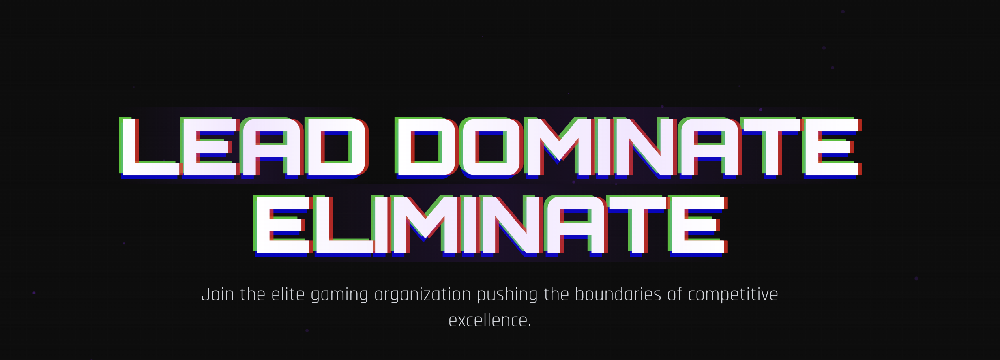

# LDE Esports Website

A modern, responsive website for the LDE (Lead Dominate Eliminate) esports organization built with React, TypeScript, and Tailwind CSS.



## Link 
- https://lde-org.netlify.app/

## Features

- 🎮 Interactive team roster showcase
- 🏆 Tournament tracking and results
- 📰 News and announcements section
- 🖼️ Media gallery with lightbox
- 📱 Fully responsive design
- ✨ Modern UI with animations
- 📝 Contact form with validation

## Tech Stack

- React 18
- TypeScript
- Vite
- Tailwind CSS
- Lucide React Icons

## Getting Started

### Prerequisites

- Node.js 18.0.0 or higher
- npm or yarn

### Installation

1. Clone the repository
```bash
git clone https://github.com/Patelmedhansh/LDE-WEB.git
cd lde-esports
```

2. Install dependencies
```bash
npm install
```

3. Start the development server
```bash
npm run dev
```

4. Build for production
```bash
npm run build
```

## Project Structure

```
src/
├── components/     # React components
├── utils/         # Utility functions
├── App.tsx        # Main application component
└── main.tsx       # Application entry point
```

## Contributing

1. Fork the repository
2. Create your feature branch (`git checkout -b feature/AmazingFeature`)
3. Commit your changes (`git commit -m 'Add some AmazingFeature'`)
4. Push to the branch (`git push origin feature/AmazingFeature`)
5. Open a Pull Request

## License

This project is licensed under the MIT License - see the [LICENSE](LICENSE) file for details.

## Acknowledgments

- Images from [Pexels](https://www.pexels.com/)
- Icons from [Lucide](https://lucide.dev/)
